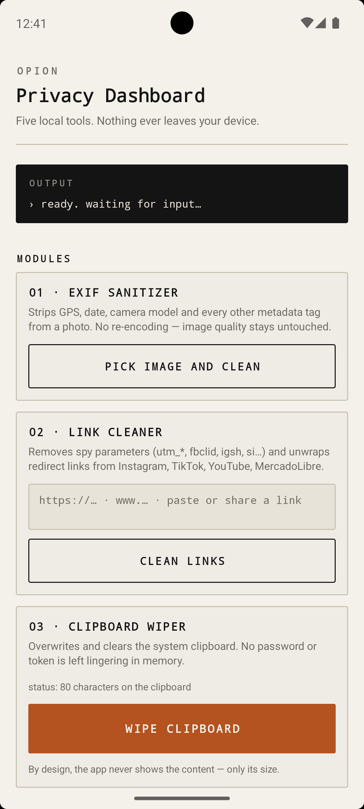
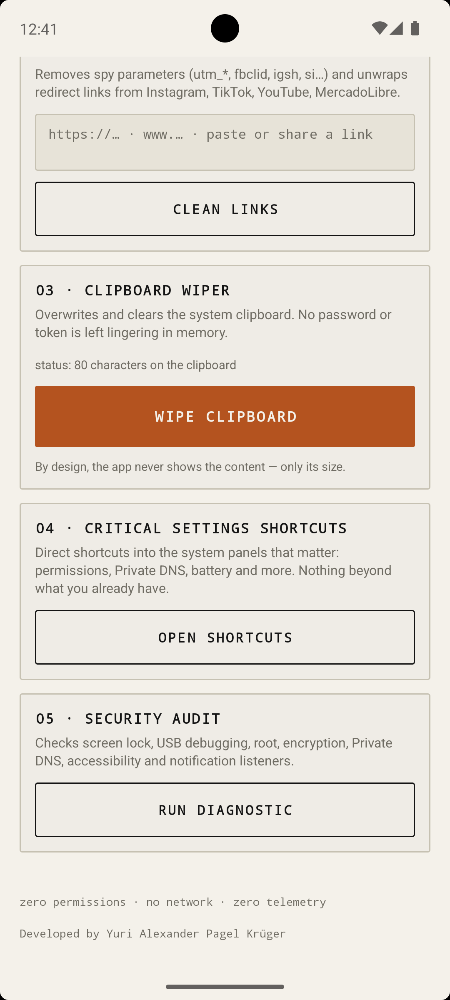
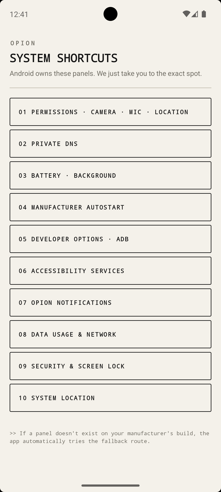
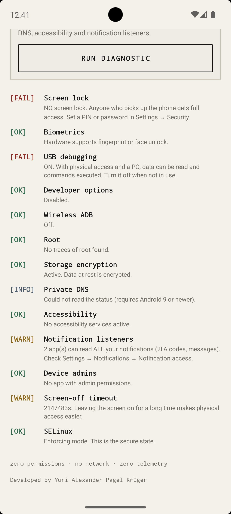

# Opion

**Opion** is a local-first privacy toolkit for Android, written in Kotlin. Available in both **English and Spanish**, it is built for users who want real control over their data without root, without Shizuku, and without granting a single invasive permission. *Opion* replaces scattered system menus and sketchy "cleaner" apps with five focused, auditable tools that run entirely on-device.

Featuring a minimal industrial interface and a paper-and-ink aesthetic, the app strips metadata from photos, removes tracking parameters from links, wipes the clipboard, jump-starts critical system settings, and audits the device's basic security posture—all from a single lightweight APK.

---

## 📸 Screenshots

<table align="center" style="border-collapse: collapse; border: 1px solid #333;">
  <tr>
    <td width="50%" align="center" style="padding: 6px; border: 1px solid #333;">
      
    </td>
    <td width="50%" align="center" style="padding: 6px; border: 1px solid #333;">
      
    </td>
  </tr>
  <tr>
    <td width="50%" align="center" style="padding: 6px; border: 1px solid #333;">
      
    </td>
    <td width="50%" align="center" style="padding: 6px; border: 1px solid #333;">
      
    </td>
  </tr>
</table>

---

## ✨ Key Features

* **Bilingual Support (English & Español):** Native support for both English and Spanish languages, automatically matching the system locale with manual toggle availability.

* **Zero Permissions:** The manifest declares no `<uses-permission>` at all—not even `INTERNET`. The app is physically incapable of transmitting data off the device, because Android never grants it the capability in the first place.

* **No Re-Encoding EXIF Sanitizer:** Reads and strips metadata tags in-place on the original JPEG stream via `androidx.exifinterface`, preserving pixel-perfect image quality. Non-JPEG formats fall back to a lossless-orientation re-encode that guarantees zero metadata.

* **Photo Picker Integration:** Uses the native `ActivityResultContracts.GetContent` selector (SAF) so the user never has to grant `READ_EXTERNAL_STORAGE`. Clean copies are staged in the app's private cache and shared via `FileProvider`.

* **Tracking URL Cleaner:** Removes 60+ known spy parameters (`utm_*`, `fbclid`, `igsh`, `si`, `gclid`, `mc_eid`…) and unwraps redirect links from Instagram, TikTok, YouTube, Facebook, and Google. Handles both bare URLs and URLs embedded in free text.

* **One-Tap Clipboard Wiper:** Overwrites the system clipboard with random noise and then clears it in a single tap, using `ClipboardManager` alone. Passwords and tokens stop lingering in memory.

* **Universal System Shortcuts:** Direct `Intent`-based entry points into the panels that matter—permissions, Private DNS, battery optimization, accessibility, developer options, data usage—with automatic OEM fallbacks for Xiaomi, Huawei, OPPO, vivo, Samsung, and more.

* **Native Security Audit:** A single tap runs 13 checks against public APIs only—no root required. Reports screen lock, USB debugging, wireless ADB, root binaries, storage encryption, Private DNS, notification listeners, device admins, and SELinux mode with icon-coded pass/warn/fail indicators.

* **Universal Compatibility:** Fully compatible from Android 8 (API 26) to the latest Android releases.

---

## 🌐 Languages

* **English:** Full native interface, built-in system prompts, and uncompromised UI flow.
* **Spanish:** Authentic end-to-end localization designed specifically for native speakers.

---

## 🛡️ Privacy by Design

* **No Network Permission:** `INTERNET` is not declared. The app cannot phone home, ever.
* **No Analytics, No Telemetry:** Zero third-party SDKs. Zero trackers. Zero ads.
* **No Cloud, No Accounts:** Everything runs on the device. Nothing is uploaded.
* **Open Source:** Full source available for audit.

---

## ⚙️ What Does It Do? (Available Modules)

From the main dashboard, *Opion* provides the following operations:

1. **EXIF Sanitizer:** Select a photo (or share one from another app) and the tool purges GPS coordinates, timestamps, camera model, serial numbers, and Windows XP metadata tags—returning a clean copy ready to send.

2. **Link Cleaner:** Paste a URL or share a link from Instagram, TikTok, YouTube, or MercadoLibre. The tool strips tracking parameters and unwraps redirect chains, leaving a clean destination.

3. **Clipboard Wiper:** One button. The clipboard is overwritten with random data and then cleared. No password or token is left exposed in memory.

4. **Critical Settings Shortcuts:** Opens the exact system panels for permissions, Private DNS (AdGuard, Cloudflare, NextDNS), battery optimization, OEM autostart, accessibility, and network—the panels Android blocks apps from modifying directly.

5. **Security Audit:** Runs a millisecond-fast diagnostic covering screen lock, biometrics, USB debugging, developer options, wireless ADB, root traces, storage encryption, Private DNS mode, accessibility services, notification listeners, device admins, screen timeout, and SELinux state.

---

## 🛠️ Built With

* **Language:** Kotlin 2.0
* **UI:** XML layouts + ViewBinding (no Compose, no Material Components)—keeps the runtime footprint minimal.
* **Platform APIs:** `androidx.exifinterface`, `ClipboardManager`, `KeyguardManager`, `DevicePolicyManager`, `Settings.Global/Secure/System`, `ActivityResultContracts` (SAF), `FileProvider`, `MediaStore`.
* **Architecture:** Single-module app with a clean separation between UI (`Activities`), domain utilities (`ExifSanitizer`, `TrackingCleaner`, `ClipboardWiper`, `PrivacyShortcuts`, `SecurityAuditor`), and resource layer.
* **Minimum SDK:** API 26 (Android 8.0) — universal compatibility.
* **Target SDK:** API 34 (Android 14).
* **Development Environment:** Android Studio.

---

## 🚀 Installation & Usage

1. Download the signed APK from the [**Releases**](../../releases) section.
2. Enable "Install from unknown sources" for your browser or file manager, then open the APK to install.

*Note:* The app declares no runtime permissions. It will never prompt for storage, camera, location, or network access—by design.

---

## 👨‍💻 Author

Developed by **Yuri Alexander Pagel Krüger**
